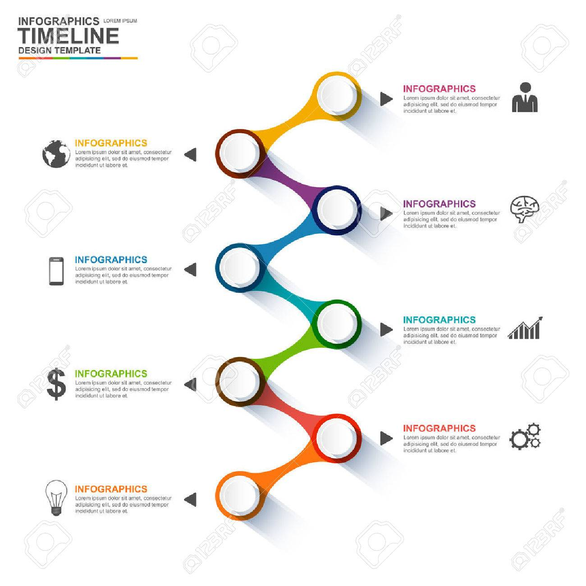
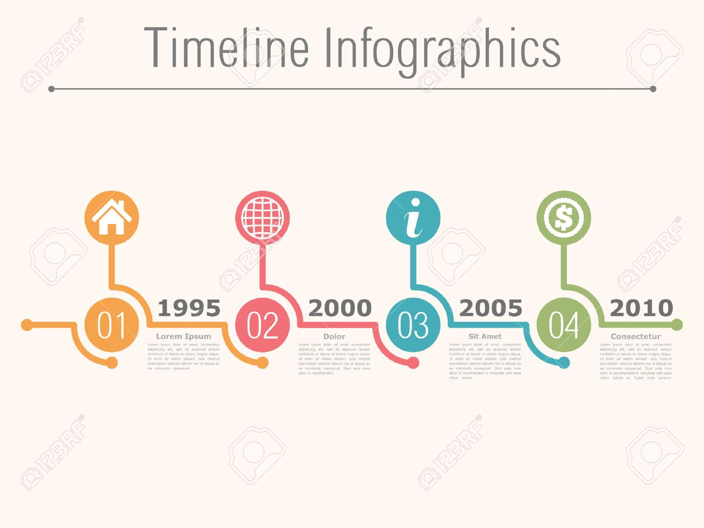
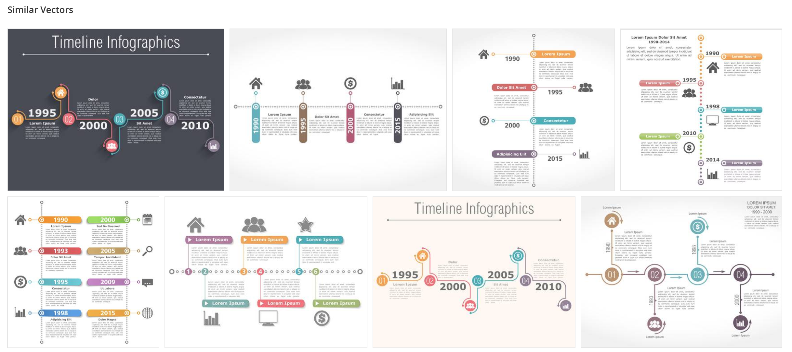
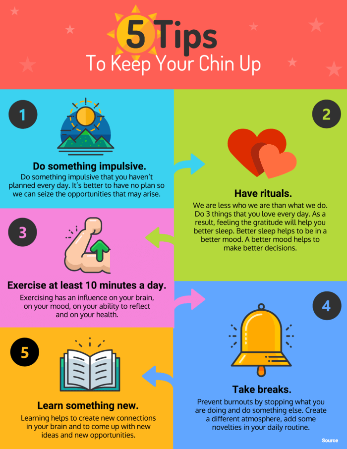
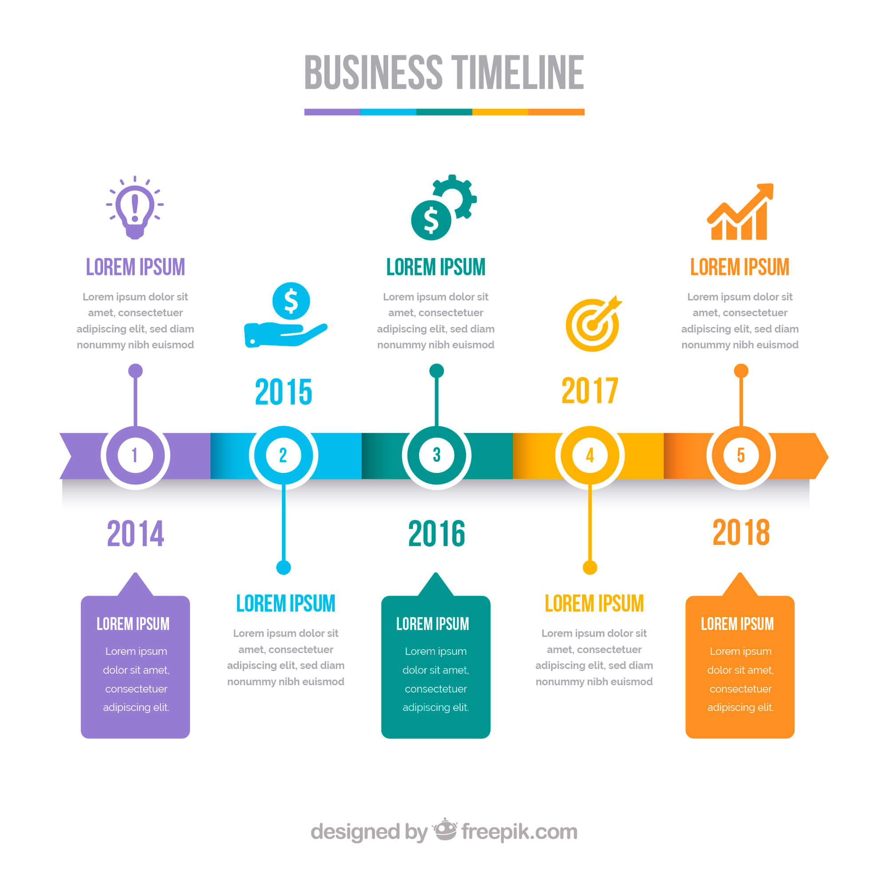
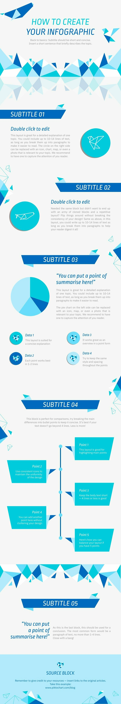
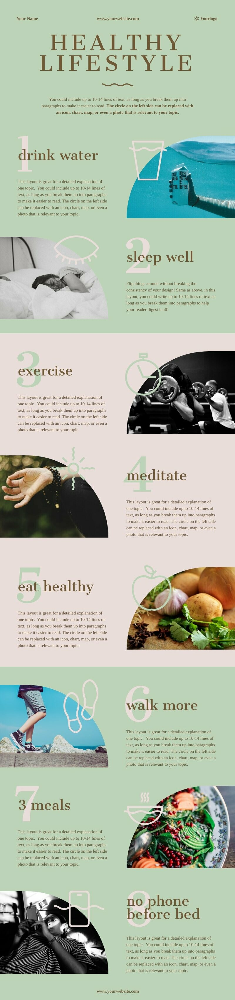
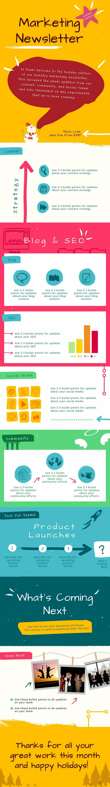

# list of ideas for infographic templates

the color is good and impressive, can change the design a bit to suitable for our infographic

remove icon, use this template + color

the [color](https://www.123rf.com/photo_33135556_stock-vector-timeline-infographics-design-template-with-numbers.html?fromid=SWV2eWpDUm1ZOVY2OGdhV0ZTVXd1QT09) is nice, can also copy tree styling

in the recommendation, there are ton of similar infographic

there is a lot of style for infographic timeline in this collection:
https://graphicriver.net/item/timeline-infographics-google-slides-presentation-template-diagrams/23221574?_ga=2.100743044.423586482.1578023855-1082626804.1578023855

https://www.google.com/imgres?imgurl=https%3A%2F%2Ftheanhgroup.com%2Fuploads%2Ftin-tuc%2Fthu-thuat-may-tinh%2Finfographic-la-gi.png&imgrefurl=https%3A%2F%2Ftheanhgroup.com%2Finfographic-la-gi-quy-trinh-thiet-ke-infographic-chuyen-nghiep.html&docid=l0i2TN65Q0i99M&tbnid=En96XJrIJ9rUMM%3A&vet=10ahUKEwi_wt_Fw-bmAhVKfH0KHbYZBvQQMwjxAShgMGA..i&w=700&h=906&bih=864&biw=1680&q=infographic&ved=0ahUKEwi_wt_Fw-bmAhVKfH0KHbYZBvQQMwjxAShgMGA&iact=mrc&uact=8

can try to design a timeline with color block

nice color to have

nice colors and references https://www.canva.com/templates/search/infographics/

simple timeline https://br.freepik.com/vetores-gratis/infografico-timeline_774158.htm

nice color of tree https://br.freepik.com/vetores-gratis/infografico-de-linha-do-tempo-plana-colorida_4749064.htm

some free vector to download https://graphicmama.com/blog/free-vector-infographic-templates/

https://create.piktochart.com/infographic

another one, block by block

how about handwriting styles ?

https://www.canva.com/templates/EADakDZsh70-orange-pet-schedule-timeline-infographic/

# tools 
https://www.websiteplanet.com/blog/best-infographic-tools/